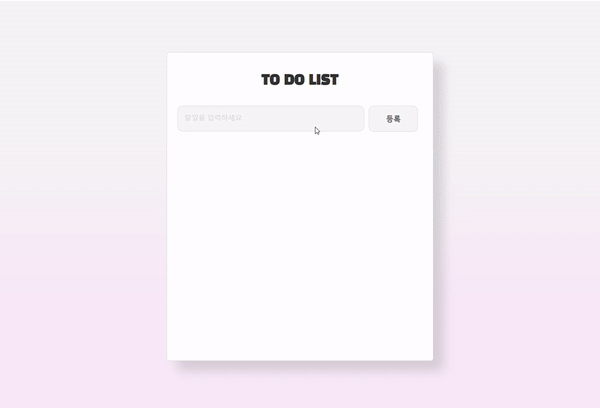

# todo-list
할일을 작성하고 관리하는 todo-list
Dom API를 활용하여 만든 간단한 toy-project



 ## 프로세스
1. 입력창 (input)에 할일을 입력
2. 입력창 내용이 없다면 알림창 경고메세지 출력
3. 입력된 내용의 각각 삭제, 완료 버튼과 함께 하단에 리스트 추가
4. 삭제 버튼시 해당 리스트 삭제
5. 완료 버튼시 해당 리스트 예시) ~~텍스트~~ 와 같이 체크

## 상세설명

**1. Html 기본 틀**
```html
	<h1>TO DO LIST</h1>
    <div class="add-element">
      <input type="text" id="task-input" placeholder="할일을 입력하세요.">
      <button id="btn">등록</button>
    </div>

    <div class="list-element">
      <ul id="list"></ul>
    </div>
```

- 사용자로부터 할일을 입력받도록 input창 생성
- input 창에 입력된 텍스트를 등록할 등록 버튼 생성
- 입력받은 할일을 ul 자식요소로 추가되도록 기본틀 구성


**2. Element 객체 변수 저장 **

```javascript
var input = document.getElementById('task-input')';
var btn = document.getElementById('btn');
var ul = document.getElementById('list');

```
- id 속성을 가진 요소를 찾고, 이를 나타내는 Element 객체를 각각 변수에 저장

**3. 할일 리스트 추가 **

```javascript
btn.addEventListener('click', function(e){
  if(input.value.length==0){
    alert("할일을 입력하세요!")
  }
  else{
    var li = document.createElement("li");
    li.appendChild(document.createTextNode(input.value));
	li.setAttribute("id","li"+cnt); 
    li.innerHTML += "<button type='button' onclick='removeTodo("+cnt+")'>삭제</button>";
    li.innerHTML += "<button type='button' onclick='completeTodo("+cnt+")'>완료</button>";
    ul.appendChild(li);
    cnt++;
    input.value="";
  
  }
})

```

- 버튼 클릭시 이벤트 발생하도록 설정
- input 값이 0이라면 input창에 할일을 입력하지 않았으므로 alert 알림
- 입력된 리스트가 있다면, ul 자식요소인 li 문서객체생성
- 생성된 li 변수에 input 입력값 textNode로 추가
만들어진 li 태그들 사이의 서열을 주기 위해 li.appendChild로 텍스트값 추가
해당 li태그 서열을 구분 이유는 li 순서를 이용하여 완료, 삭제 처리를 하기 위함
- li 속성을 조작하기 위해 setAttribute를 이용하여 li 속성에 값 지정
- innerhtml을 사용하여 각각의 li태그에 버튼 추가되도록 설정
버튼을 추가와 버튼이 클릭되었을때 함수호출 하도록 설정
호출시 파라미터 cnt 입력
cnt를 인자로 넘겨주는 이유는 완료, 삭제 처리시 서열이 지정된 해당 li를 완료, 삭제 처리
- appenChild를 이용하여 ul 자식요소노드로 li 추가


**4. 할일리스트 삭제처리 **

```javascript
function removeTodo(cnt){
  var todolist = document.getElementById('li'+cnt)
  ul.removeChild(todolist);
}

```
- 삭제버튼 클릭시 해당 함수 호출
- removeChild 사용으로 ul 자식요소인 li를 cnt 해당되는 서열 삭제

**5. 할일리스트 완료처리 **

```javascript
function completeTodo(cnt){
  var todolist = document.getElementById('li'+cnt) 
  todolist.style.textDecoration = "line-through"
  todolist.style.textDecorationColor = "red"
}

```

- 완료버튼 클릭시 해당 함수 호출
- 해당되는 li태그의 sytle 지정


### 프로젝트를 마치며
해당 프로젝트를 통해 DOM API 활용방법과 이벤트리스너 활용방법에 대해 알 수 있었습니다.